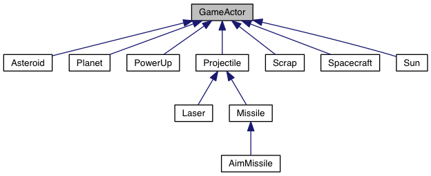

% Projekt im Kurs "Entwicklung von Multimediasystemen"
% Lukas Hodel; Robert Kasseck; Richard Remus
% 29. Januar 2015

#Vorbereitung des Projektes

##Idee
Um die Größe unserer Projektgruppe zu legitimieren, galt es ein Projekt mit hinreichender Komplexität zu finden. Bald hatten wir uns für ein selbst gestaltetes Spiel entschieden. Da wir uns bis zu diesem Zeitpunkt noch nicht mit Echtzeitspielen beschäftigt hatten, fanden wir diesen Bereich recht interessant. Auch wollten wir ein bisschen Physik in den Spielablauf einbringen. Wir einigten uns bald darauf, einen 2d-Weltraum-Shooter zu entwickeln. Darin sollte es darum gehen gegnerische in einem Spielfeld zu bekämpfen, in welchem Planeten und Sonnen die Schussbahn der Projektile beeinflussen können. Ziel des Spiels sollte es sein, als erster einen zuvor vereinbarte Zahl von Abschüssen zu erreichen. Zusätzlich sollte das Spiel über das Netzwerk spielbar sein und auch über optionale, vom Computer gesteuerte Gegner beinhalten. Wichtig war uns auch, die Logik und die GUI stark zu entkoppeln. 

##Anforderungen

### Ziel
Implementierung eines Mehrspieler-Weltraum-Shooters (Gravitron) in C++.

### Basic Features
- (5) Objekte verfügen über eine Gravitation relativ zu ihrer Masse.
- (5) Das Spiel soll über das Netzwerk im Multiplayer spielbar sein, wobei ein Spieler der Host ist.
- (5) Es soll eine KI mit 3 Schwierigkeitsstufen beinhalten.
- (2) Einstellungen werden lokal persistent gespeichert.
- (2) Jedem Spieler wird die Sicht relativ zu seinem Raumschiff gerendert.
- (3) Es soll zwischen den Sprachen Englisch und Deutsch gewechselt werden können.

### Spielfeld
(5) Das Spielfeld ist eine Fläche. jeder Spieler steuert sein eigenes Schiff und bewegt sich auf der Fläche.

### Spielmodus
(2) Es handelt sich um ein klassisches Deathmatch, d.h. jeder Spieler erzielt Punkte durch das Abschießen gegnerischer Schiffe.
Wer auf diese Weise eine vorher definierte Punktzahl erreicht, gewinnt und das Spiel wird beendet. 

### Gravitationssystem
(5) Alle im Spielfeld befindlichen Objekte (Raumschiffe, Planeten, Schwarze Löcher...) besitzen eine Gravitation relativ zu ihrer Masse. Diese beeinflusst die Flugbahn von Geschossen und Schiffen.

### Nicht-Spieler-Objekte
- (1) Planeten
- (1) Schrott
- (1) Asteroiden 

### Arten von Waffen
- (2) Laser
- (2) Rakete
- (3) Zielsuchende Rakete

### Kollisionen
(2) Es wird für alle möglichen Kollisionen eine eine spezifische Behandlung
definiert. Beispielsweise führt die Kollision mit einem Planeten zu einer stärkeren Beschädigung des Schiffes, als die Kollision mit einem Asteroiden.

### PowerUps
(3) Das Abschießen eines gegnerischen Schiffes kann ein PowerUp erzeugen, welches von allen Spielern aufgesammelt werden kann. 

### Mögliche Arten von PowerUps:
(1) Waffenaufwertung

## Plattformen
(1) Linux, OSX, Windows

##Einarbeitung
Wir wollten unser Projekt so gut und professionell wie möglich umsetzen. Dementsprechend einigten wir uns darauf, nicht gleich los zu programmieren, sondern hinreichend viel Zeit zunächst in Recherche und anschließend in durchdachtes Design zu investieren. 

Wir informierten uns über ähnliche Spiele, versuchten deren Designentscheidungen zu verstehen. Auch beschäftigten wir uns mit der allgemeinen Theorie der Spielentwicklung und stießen so auf das Buch _Game Programming Patterns_ von Robert Nystrom. Dieses Buch sollte für uns bald eine wichtige Inspiration und Wissensquelle werden. 

Für die Umsetzung physikalischer Gesetzmäßigkeiten bedienten wir uns dem Buch _The Nature of Code_ von Daniel Shiffman, in welchem die Umsetzung von Naturgesetzen mithilfe von in __Processing__ geschriebenen Codebeispielen zu erläutern.

Auch ging einige Zeit in das gedankliche durchdringen des Qt-Frameworks im Bereich GUI. Die Projektwebsite bot dabei immerhin in den meisten Fällen Hilfe und Beispiele. Ein gelegentliches Anecken an der Logik von Qt und auch entsetztes Unverständnis derer ließen sich jedoch manchmal nicht Vermeiden.

Darüber hinaus nutzten wir auch eine kurze Zeit um unserer Kenntnisse von C++ ein wenig aufzufrischen.

#Qt/Qml 
Als GUI-Sprache haben wir uns für QML und gegen die QWidgets entschieden, weil durch QML eine saubere Trennung von Code und Design möglich ist und weil es in Zukunft der Standard von QT sein wird.

## Scene Management
Das erste Problem stellte sich in der Menüführung. Wie ist es möglich in QML zwischen verschiedenen Views zu schalten? Zuerst versuchten wir es indem wir die einzelnen Ebenen einfach mit dem Visibility-Parameter sichtbar und unsichtbar machten. Diese Lösung fühlte sich jedoch nicht sehr elegant an.
Da in den meisten Fällen in denen QML verwendet wird, nicht das Standard-QML verwendet wird, sondern GUI-Libraries von Firmen wie Blackberry oder Nokia, gibt es nicht all zu viel Hilfe im Internet. Es gibt sozusagen keine _best practices_.

Wir haben am Ende eine Lösung gefunden, in der wir im __main.qml__ ein __ScrollView__-Element einfügten, welches eine __ListView__ beinhaltet. Dieser ListView wiederum geben wir als Model ein __VisualItemModel__. Ein VisualItemModel kann wiederum andere QML-Objekte beinhalten. Dabei nutzen wir nun in dem VisualItemModel ein __Loader__-Objekt, welches QML-Objekte nachladen kann. Wenn wir nun also in der Menüstruktur in eine andere Ebene gelangen, müssen wir nur noch dem __Loader__ eine neue _source_ (Pfad zu einer QML-Datei) geben. Mit dieser Struktur können wir nun ziemlich elegant geschachtelte Menüs erstellen.

```javascript
  VisualItemModel {
      id: theModel
      Column {
          anchors.horizontalCenter: parent.horizontalCenter
          anchors.verticalCenter: parent.verticalCenter
          Loader { 
              id: modelLoader
              source: "menus/Main.qml" 
          }
      }
  }

  ScrollView {
      z: 1
      id: scrollView
      anchors.fill: parent

      ListView {
          id: main_list
          model: theModel
          header: Item { height: 70 }
          footer: Item { height: 50 }
          anchors.fill: parent
      }
  }
```

## Property Binding
Ein weiteres Problem bestand darin QML-Controls an C++-Objekte zu _binden_. Dafür muss man zuerst ein C++-Objekt auf QML-Ebene verfügbar machen. Eine Möglichkeit ist es, beim Laden des QMLs, dem Objekt Referenzen zu C++-Objekten registrieren. Dies scheint nicht sehr elegant, ist jedoch ziemlich Effizient.

```javascript    
  // Hier wird ein Settins-Objekt unter dem 
  // Namen "Settings" in QML verfügbar gemacht.
  GravitronSettings settings;
  engine.rootContext()->setContextProperty("Settings", &settings);
```

Sobald man dies gemacht hat, kann überall im QML auf das Settings-Objekt zugegriffen werden. So können nun auch QML-Controls gebunden werden:

```javascript
  // Hier wird der playerName von den registrierten Settings geholt.
  // sobald der Benutzer den Focus vom Feld weg nimmt, wird 
  // ebenfalls über das Settings-Objekt der neue Spielername gesetzt.
  TextField {
      id: txt_playerName
      height: Global.textFieldHeight
      width: Global.textFieldWidth
      placeholderText: qsTr("Name")
      text: Settings.playerName
      onEditingFinished: Settings.setPlayerName(txt_playerName.text)
  }
```

Es muss dabei beachtet werden, dass keine Loops entstehen. Wenn wir z.B.
die __setPlayerName()__-Methode nicht bei __onEditingFinished__, sondern bei __onTextChanged__ aufrufen, würde ein solcher Loop entstehen.

#Spiellogik

Ein sehr kritischer Teil des Projektes bestand in der inneren Spiellogik. Sie bestimmt die Regeln, den Ablauf und auch jeden möglichen Zustand des Spiels. Ihre Aufgabe ist es auch, den Zustand der einzelnen Akteure des Spiels konsistent zu halten. Um die Umsetzung der Logik unabhängig von Qt zu halten, haben wir uns entschieden die Spiellogik völlig von den anderen Bestandteilen des Spiels zu entkoppeln. 

##GameActor
Die Klasse GameActor repräsentiert jedes denkbare Objekt, das Teil des Spielgeschehens ist. Dazu zählen die Raumschiffe der Spieler, Planeten, Sonnen, Weltraumschrott, Asteroiden aber auch jegliche Geschosse der Waffen über die die Schiffe verfügen. 



Die wichtigsten Eigenschaften eines GameActors sind seine Position, Geschwindigkeit, Beschleunigung, Masse, Lebenspunkte, Gravitationskraft sowie die Reichweite, über welche seine Gravitation andere GameActors beeinflussen kann. Seine Positionierung und Bewegung werden mit elementarer Vektorrechnung realisiert. Wann immer eine Kraft auf einen GamActor wirken soll, wird die Methode __applyForce()__ mit einem  entsprechenden Kraftvektor verwendet. Die angewendete Kraft wirkt sich zunächst nur auf seinen Beschleunigungsvektor addiert, erst beim Aktualisieren des GameActors über __update()__ wird der Beschleunigungsvektor mit dem Geschwindigkeitsvektor verrechnet und mit diesem dann schließlich die neue Position bestimmt.
Falls GameActors miteinander Kollidieren wird dies mithilfe der __collisionDetection()__ aus der __Physics__-Bibliothek ermittelt. Durch Implementation der virtuellen Methode __handleCollision()__ kann festgelegt werden, wie der jeweilige GameActor mit einem Zusammenstoß umgehen soll. Sollte er schaden nehmen, kann dies mit __dealDamage()__ realisiert werden, diese Methode bestimmt dabei auch, ob der zugewiesene Schaden die maximale Zahl von Lebenspunkten überschreitet und aktualisiert das Feld __killed__ dementsprechend. __addHealth()__ agiert in analog entgegengesetzter Weise zu __dealDamage()__ wobei wir jedoch davon ausgehen, dass ein getöteter oder zerstörter GameActor nicht "wiederbelebt" werden sollte. Dies sollte, falls nötig über einen anderen Weg geregelt werden. Zusätzlich definieren wir mit einer Lebenspunktzahl von -1 einen GameActor, der nicht durch das Zuteilen von Schaden durch __dealDamage()__ sterben kann. Falls ein GameActor durch seinen Tod einen Effekt auf das Spielgeschehen haben, zum Beispiel eine Explosion oder das setzen eines PowerUps, kann dies in der virtuellen Methode __handleKill()__ definiert werden. 

##Projectile
Mit Projectile sollen alle möglichen Arten von Geschossen realisiert werden. Das könnten Laser und Raketen, aber auch Bomben, Minen oder andere Dinge sein, welche durch eine Waffe im Spielfeld platziert werden können. Projectile erbt von GameActor, bringt aber ein paar Erweiterungen. Zum einen kann es den Punktestand von befreundeten Raumschiffen beeinflussen, wobei "befreundet" bedeutet, dass dieses Projectile sie nicht in negativer weise beeinflussen kann. Zum anderen kann für jedes Projectile eine maximale Lebensdauer (time to live), gemessen in Update-Zyklen. Dadurch soll simuliert werden, dass die meisten Geschosse keine unendliche Reichweite haben, eine Rakete könnte zum Beispiel eine begrenzte Menge Treibstoff haben. Erreicht ein Projectile eine __timeToLive__ von null, wird es als __killed__ behandelt. In analoger Weise zu den Lebenspunkten des GameActors definieren wir, dass ein Projectile unbegrenzte Lebenszeit hat, wenn es eine __timeToLive__ von -1 hat.
Darüber hinaus gehorcht das Projectile allen durch GameActor definierten Regeln, sofern diese nicht überschrieben werden.

#Programmlogik 	

##Game
Wie schon erwähnt, fanden wir im Rahmen der Recherche das Buch _Game Programming Patters_. Dies gab uns ein gutes Verständnis der Umsetzung und Aufbau eines Echtzeitspieles. In ihm stießen wir auch auf eine Vorlage unseres GameLoops.

## GameLoop

Für die Umsetzung des GameLoops einigten wir uns auf die folgende Implementierung:

```javascript
  while (true)
  {
    double start = getCurrentTime();
    processInput();
    update();
    render();
    sleep(start + MS_PER_FRAME - getCurrentTime());
  }
```

Es wird sequenziell zuerst den Benutzerinput verarbeitet (__processInput()__), dabei handelt es sich um Inputs über das lokale Keyboard oder über auch über das Netzwerk.
Anschließend wird der Spielstatus neu berechnet indem alle GameActors aktualisiert werden (__update()__). Wenn der neue Spielstand berechnet wurde, wird der View gerendert.
Wenn dann noch Zeit übrig bleibt, wird diese wird der Prozess schlafen gelegt. So garantieren wir eine konstante Spielgeschwindigkeit, unabhängig von der Hardware des jeweiligen Systems. 

### Rendern in einem anderen Thread.
Der GameLoop ist ein eigener Thread, das tatsächliche rendern wird nicht im GameLoop bewerkstelligt. Dort werden lediglich die Daten vorbereitet, damit sie universell gerendert werden können. Dabei werden die vorbereiteten Views über QTs eigene Signale weitergereicht.

### C++ Qml Mapping
Um den Spielstand universell rendern zu können und somit die Logik vom Design zu trennen, mussten wir ein Datenobjekt erstellen, welches die Eigenschaften eines Spielobjektes einfach darstellen kann. Dabei haben wir den GameActorView entwickelt. Der GameActorView ist streng genommen nur eine Liste mit _Key-Value-Pairs_. Er speichert die Eigenschaften als Keys und deren Values.
Jeder GameActor, kann nun einen GameActorView von sich und seinem aktuellen Status erstellen. Dieser View kann dann serialisiert werden und an einer beliebigen anderen Stelle wieder gelesen werden. Ob dann aus dem View ein QML-Objekt generiert wird oder mit OpenGL ein Objekt gerendert wird ist egal.

In unserem Fall werden diese GameActorViews im __Game.cpp__ von der Methode __render()__ gelesen. Dann wird für jeden View ein QQuickItem generiert. Welche QML-Datei verwendet werden soll, wird ebenfalls im GameActorView definiert. So kann einfach für jeden GameActor eine eigen GameActor.qml erstellt werden.

Der Schwierige Punkt in diesem Szenario war, wie man aus C++ heraus QML-Objekte generieren kann:

```javascript
  // Zuerst muss der QML-Pfad vom GameActorView gelesen werden. 
  // Dieser definiert welche .qml-Datei für 
  // den View verwendet werden soll.
  QString path = QString::fromStdString((*view)->getQmlPath());

  // Dann wird eine neue Komponente davon erstellt
  QQmlComponent component(engine, QUrl(path));
  QQuickItem *childItem = qobject_cast<QQuickItem*>(component.create());

  // Dieser muss dann ein Parent gegeben werden. In unserem Fall ist 
  // der qmlParent dem Game-Objekt bekannt.
  childItem->setParent(qmlParent);
  childItem->setParentItem(qmlParent);

  ...

  // Dann können die einzelnen Eigenschaften dem QQuickItem 
  // übergeben werden.
  for(pit = props.begin(); pit != props.end(); pit++) {
      childItem->setProperty(pit->first.c_str(), pit->second.c_str());
  }
```

##Updates

## Multi-Key InputHandling	
Beim _Inputhandling_ handelt es sich um die Aufnahme und Verarbeitung von Keyboard-Inputs durch den Spieler.
Das erste Problem stellte sich in diesem Bereich darin auch mehrere Keys parallel zu erkennen. Wenn man einfach auf den KeyDown Input-Event hört kommen die parallel gedrückte Tasten hintereinander. Und noch viel schlimmer ist, dass das Drücken der einen Taste, die anderen Tasten blockiert.
Um dieses Problem zu lösen hören wir nicht nur auf den KeyDown-Event sondern auch auf den KeyUp-Event. Dazu nutzen wir einen Input-Liste (eigentlich ein Vektorobjekt), welcher bei KeyDown den Keycode speichert. Bei KeyUp vom gleichen Code wird dieser wieder von der Liste gelöscht.
Um herauszufinden, welche Keys gerade gleichzeitig gedrückt werden, kann nun einfach über die input-Liste iteriert werden, egal ob eine Taste die anderen blockiert. Eine Taste ist gedrückt, bis ein KeyUp-Event der gleichen taste wieder kommt.

### Mutex für Thread Safety
Da der GameLoop in einem eigenen Thread existiert, die Inputs aber vom Hauptthread kommen, verwenden wir beim schreiben und lesen der Input-Liste einen Mutex. So kann der GameLoop von der Liste lesen und der Hauptthread schreiben ohne dass es zu Kollisionen kommt.

## Netzwerk
Um das Netzwerk zu ermöglichen haben wir eine __TcpServer__- und __TcpClient__-Klasse geschrieben. Diese werden beim Programmstart initialisiert. Es besitzen also alle Spieler einen Server und einen Client, egal ob sie der Server oder Client im Spiel sind.

Auch war es wichtig zu definieren, welche verschiedenen Pakete wir übermitteln wollen. Sozusagen ein eigenes Protokoll. Dabei sind wir auf folgende Typen gekommen.

Die __Views__ sind die zu übertragenen GameActorViews, welche vom Client gerendert werden sollen. Pakete welche Views sind, starten immer mit einem _v_ und enden mit einer _newline_.

Die __Inputs__ sind die Keyboadinputs vom Netzwerkspieler welcher auf dem Server sein Raumschiff steuern möchte. Input-Pakete starten immer mit einem _i_ und enden mit einer _newline_.

Die __Controls__ sind Steuerbefehle vom Server zum Client. z.B. der Spielbeginn , das Aktualisieren des Lebensbalkens, die Position des Hintergrundbildes usw. Diese Pakete starten immer mit einem _c_ und enden mit einer _newline_.

Grundsätzlich Enden alle Pakete mit einer _newline_. Dieser Entscheidung liegt die Tatsache zugrunde, dass wir das Problem hatten, dass Pakete _gesplitted_ versendet wurden und so zum Absturz des Spiels führten. Mit dieser Lösung können wir auf der Ebene des TCP-Sockets überprüfen ob ein Paket vollständig angekommen ist. Wenn dies nicht der Fall ist (_newline_ fehlt) buffern wir das Packet und fügen es mit dem nächsten Paket zusammen, bis es wieder vollständig ist.

### Remote Rendering
Da wir bereits das Rendern komplett vom Gameloop getrennt hatten, konnten wir nun den Rendermechanismus relativ einfach netzwerkfähig machen. Um das zu realisieren, haben wir den TcpClient mit einer __remoteRender()__-Methode verbunden.
Diese __remoteRender()__-Methode überprüft, ob das erhaltene Paket einen View beinhaltet, also mit _v_ beginnt. Wenn dies der Fall ist, generiert die Methode daraus wieder eine liste von GameActorViews und ruft die gleiche __render()__-Methode auf wie der Server. Diese Methode rendert nun aus den GameActorViews wieder QML-Objekte und zeigt sie an.

### Remote Inputs
Um die Inputs des Netzwerkspielers zu empfangen, wird auf der Seite des Netzwerkspielers ein _Inputhandler_ erstellt wie auch für den lokalen Spieler. Dabei wird nun aber die Inputliste serialisiert über das Netzwerk versendet, sobald diese sich ändert.
Auf der Serverseite ist nun ein __NetworkInputHandler__ über _signals_ und _slots_ an den TCP-Socket der Servers gebunden. Dieser hört auf jedes erhaltene Paket und prüft ob es sich dabei um Inputs handelt. Wenn dies der Fall ist, wird das Paket deserialisiert und analog zum InputHandler in einem durch Mutex geschützten Inputvektor gespeichert. Dieser kann nun vom NetworkPlayer-Objekt bei jedem Durchlauf des Gameloops auf Inputs überprüft werden.

##Player

###HumanPlayer
Der __HumanPlayer__ besitzt einen Inputhandler mit dessen Hilfe er die aktuellen eingaben lesen kann und so das __Spacecraft__ gesteuert wird.

###HumanNetworkPlayer
Der __NumanNetworkPlayer__ unterscheidet sich nur durch den Typen des InputHandlers vom HumanPlayer. Der NetworkPlayer
überprüft in der __processInput()__-Methode den Inputvektor des __NetworkInputHandler__s. Diese connected er in seinem Konstruktor
mit den Server-Events.

Ebenfalls wird auf das Paket "cname" connected. Zu Beginn des Spiels schickt der Netzwerkspieler seinen Namen übers Netzwerk. Der __HumanNetworkPlayer__ hört darauf und setzt seinen Namen dementsprechend.

###AIPlayer

###AINetworkPlayer

#Tests
Für die Tests schrieben wir eine eigene Klasse. Diese führt die Tests mithilfe des QT-Testframeworks durch. Die beiden Klassen Physics und Vec3f bilden die Grundlage jeder Bewegung im Spiel. Dementsprechend war es von hoher Bedeutung, dass diese beiden Kassen auch immer wie erwartet arbeiten.

##Physics
Für alle Test wurde zuerst einmal ein einheitlicher Ausgangszustand geschaffen in dem zwei GameActors auf eine feste Postion gesetzt wurden. Ausgehend von diesen Positionen und Gravitationseigenschaften wurde ein erwarteter Wert errechnet und dann in dem Test für alle Methoden der Physics-Klasse geprüft ob auch diese Werte ausgerechnet werden.

##Vec3f
Analog zu den Tests der Physics-Klasse, wurde auch hier ein einheitlicher Ausgangsvektor geschaffen. Auch das weitere Vorgehen war wie bei der Phyics-Klasse.

#Speichertests
Das Projet wurde in C++ geschrieben und so ist es wichtig Speicherzugriffsfehler und Memoryleaks zu finden und zu beheben. Zunächst probierten wir das Tool __valgrind__ zu verwenden. Allerdings gab es einige Probleme, die die Analyse der Fehler unmöglich machten. Ein vermutliche Ursache ist die Speicheroptimierung von QT. Das Testen mit __sanitize__ war deutlich erfolgreicher.

##Sanitize
Der Speichertest mit __sanitize__ ist mit ein paar einfachen Compiler- und Linker-Kommandos zu nutzen. Die entsprechenden Flags wurden über die QT-Projektdatei dem Compiler und Linker übergeben:

```bash
QMAKE_CXXFLAGS_DEBUG += -fsanitize=address -O1 -fno-omit-frame-pointer
QMAKE_LFLAGS_DEBUG += -fsanitize=address
```

Der Vorteil den wir bei Gegenüberstellung von __sanitize__ und __valgrind__ war, dass __sanitize__ die Programmausführung bei einem Fehler abbricht. Dies hatte zur Folge, dass das Programm immer ohne Speicherfehler ist. Auch lief die Programmausführung mit __sanitize__ wesentlich schneller als mit __valgind__.

#Übersetzungen
Um das Programm in mehreren Sprachen zur Verfügung zu stellen, haben wir die QT-Translation-Tools benutzt. Der Text der in mehreren Sprachen angezeigt werden sollte, musste in die Funktion __qsTr()__ gesetzt werden. In der Projektdatei mussten wir angeben, für welche Sprachen es eine Übersetzungen geben soll:

```bash
TRANSLATIONS = gravitron_de.ts \
               gravitron_en.ts
```

Der Name der Übersetzungsdateien kann beliebig sein, da eine Zuordnung manuell vorgenommen werden muss. 
Um nun die Übersetzungen zu erzeugen sind die drei folgenden Schritte notwendig:
    1. __lupdate__ in Gravitron.pro: Es werden alle Dateien nach der __qsTr()__-Funktion durchsucht und als _offene_ Übersetzung registriert.
    2. Die Übersetzungsdateien können nun mit QT Linguist geöffnet und übersetzt werden.
    3. __lrelease__: Erzeugt die fertigen Übersetzungsdateien mit der Endung _.qm_.


Bei Programmausführung werden die Übersetzungen mit der Klasse __Locator__ geladen.

#Probleme beim Entwicklungsprozesses
##Qt verstehen

##Settings persistent speichern

#Ergebnisse und Einschätzung

#Fazit
Dieses Projekt war für uns gleichermaßen eine große Herausforderung und eine äußerst lehrreiche Erfahrung die wir nicht missen wollen. 
